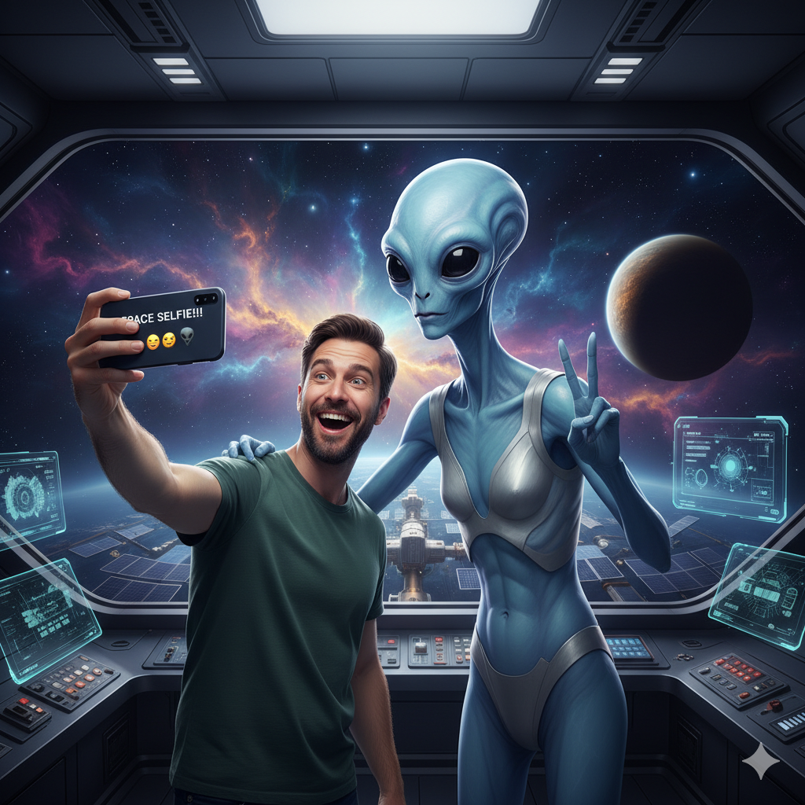

# Este es el CV de Victor

En este documento podemos ver todos los trabajos que ha tenido Victor

---

## 1º Primer trabajo: Minero de Bloques Bitcoin

En esta especie de **trabajo** (por llamaro de algún modo) tuve que minar bloques de Bitcoin, de 2016 a 2021.

## 2º Segundo Trabajo: Acariciador de Perros

En esta ocasion me pagaban 200$ la hora por acariciar perritos y asegurarme de que estaban suuuuper contentos y felices. De 2022 a 2024.

## 3º Tercer Trabajo: Viajero de agujeros negros

Por último, en mi ultima experiencia estuve viajando por algunos agujeros negros explorando otras dimensiones bastante curiosas donde econtrñe seres increibles y tuve alguna conversación con Dios. de 2024 hasta hoy.

---

### Algunos de los extraterretres que conocí fueron:

| Nombre      | Oficio            |
|-------------|-------------------|
| Shurnum     | Cafetero espacial |
| Lergonion   | Cazarecompensas   |
| Kerkon      | Jubilado          |

Todos pertenecen al club del cúmulo de galaxias Groter:

Enlace a [Club](https://www.madridmus.com/)

PD: Aqui una foto con Shurnum:

